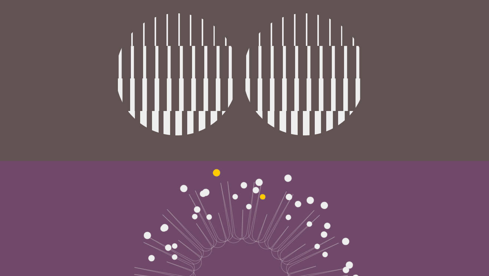

# :large_blue_circle: CSS-animation by using keyframes

A study project at Practicum by Yandex to try pure CSS-animation by using keyframes.

---

## :mag_right: Preview

---

## :link: Links to test

https://dianadomino24.github.io/css-animation-keyframes/

---

## :rocket: Technologies

-   **JavaScript ES6** - Promises, setTimeOut.

-   semantic **HTML5**, styles - **CSS3** including Flexbox.

-   CSS-animation by using keyframes.

---

**Practicum by Yandex** - https://practicum.yandex.com/

---

## :sparkles: Thanks for watching! :sparkles:
